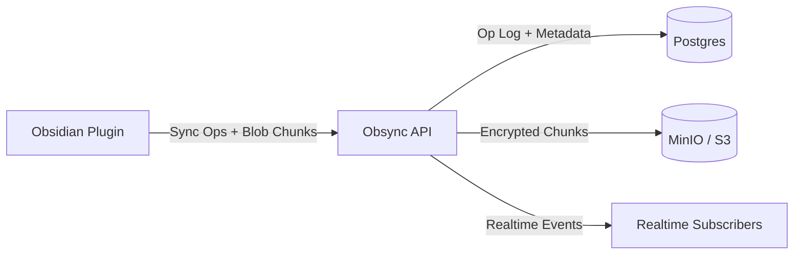

# Obsync

Self-hosted realtime sync for Obsidian vaults, with CRDT markdown convergence, encrypted blob transport, and API endpoints designed for automation agents.


## Why Obsync

- Keep sync infrastructure under your control (single-tenant, self-hosted).
- Merge concurrent markdown edits deterministically with Yjs.
- Store encrypted blob chunks in S3-compatible storage.
- Use JWT or scoped API keys for humans and agents.
- Stream updates over websocket with polling fallback.

## What Is Included

| Component | Location | Responsibility |
| --- | --- | --- |
| API server | `apps/server` | Auth, vault/device lifecycle, sync push/pull, blob APIs, key envelopes, realtime stream |
| Obsidian plugin | `apps/plugin` | Vault event capture, op building, sync transport, realtime client, local state |
| Headless sync worker | `apps/server/src/headlessSync.ts` | Poll sync stream and mirror markdown/file operations into a host path |
| Shared types/crypto | `packages/shared` | Schemas, chunking, crypto utilities, shared contracts |
| Infra stack | `docker-compose.yml` + `infra/*` | Postgres, MinIO, Convex backend, Prometheus, Loki, OTel collector, Grafana |

## Architecture (High Level)



## One-Line Install

```bash
sh -c "$(curl -fsSL https://raw.githubusercontent.com/WJVDP/Obsync/main/scripts/install.sh)"
```

Fallback (if raw GitHub is unavailable):

```bash
git clone https://github.com/WJVDP/Obsync.git && cd Obsync && sh scripts/install.sh
```

The installer is interactive and will guide you through:

1. Starting the server stack with Docker Compose
2. Bootstrapping first user + creating initial vault
3. Optionally installing the Obsidian plugin into a local vault path
4. Optionally configuring and starting headless vault mirror sync

## Quick Start (Repo Checkout)

### 1) Clone and prepare

```bash
git clone https://github.com/WJVDP/Obsync.git
cd Obsync
cp .env.example .env
```

### 2) Set a strong JWT secret

The server runs with `NODE_ENV=production` and rejects `JWT_SECRET=change-me` at startup. Set a real value in `.env`:

```bash
# generate a strong secret
openssl rand -hex 32
# then set it in .env
JWT_SECRET=<output from above>
```

### 3) Start the stack

```bash
docker compose up -d --build
```

### 4) Verify health

```bash
curl -sS http://localhost:8080/v1/admin/health
```

Expected response contains `"status":"ok"`.

### 5) Bootstrap first user (one-time)

```bash
BOOTSTRAP_EMAIL=user@example.com BOOTSTRAP_PASSWORD='change-this-password' npm run -w @obsync/server bootstrap:user
```

### 6) Login and create a vault

```bash
BASE_URL=http://localhost:8080
JWT=$(curl -sS "$BASE_URL/v1/auth/login" \
  -H 'content-type: application/json' \
  -d '{"email":"user@example.com","password":"change-this-password"}' | jq -r '.token')

VAULT_ID=$(curl -sS "$BASE_URL/v1/vaults" \
  -H "authorization: Bearer $JWT" \
  -H 'content-type: application/json' \
  -d '{"name":"Personal Vault"}' | jq -r '.id')

echo "$VAULT_ID"
```

### 7) Install Obsidian plugin

```bash
sh scripts/install-plugin.sh "/absolute/path/to/your/vault"
```

### 8) Connect from Obsidian

In Obsidian:

1. Open `Settings -> Community Plugins -> Reload plugins`.
2. Enable `Obsync`.
3. Open `Settings -> Obsync` and set:
   - `Base URL`: `http://<server-host>:8080`
   - `Vault ID`: value from the API call above
   - Auth: `API Token` or `Email + Password`
   - `Realtime`: enabled
4. Click `Connect`.

### 9) Optional: configure headless vault sync bootstrap

Run the standalone headless installer:

```bash
sh scripts/install-headless.sh
```

The installer will:

1. Prompt for `Base URL`, account email/password, optional `Vault ID`, and mirror path.
2. Log in (`POST /v1/auth/login`) and create a vault if no vault id is supplied.
3. Create a scoped API key (`read`,`write`) or prompt to keep/rotate existing `HEADLESS_API_TOKEN`.
4. Persist these keys in `.env` without reordering unrelated entries:
   - `HEADLESS_BASE_URL`
   - `HEADLESS_SYNC_BASE_URL` (defaults to `http://server:8080` for containerized worker)
   - `HEADLESS_VAULT_ID`
   - `HEADLESS_API_TOKEN`
   - `HEADLESS_MIRROR_PATH`
   - `HEADLESS_POLL_INTERVAL_MS`

For security, the installer prints only a masked API token preview after saving.
It also offers to start the `headless-sync` Docker Compose profile.

Verify headless sync worker:

```bash
docker compose --profile headless-sync ps
docker compose --profile headless-sync logs -f headless-sync
```

## Agent/API Quick Flow

Create scoped API key:

```bash
API_KEY=$(curl -sS "$BASE_URL/v1/apikeys" \
  -H "authorization: Bearer $JWT" \
  -H 'content-type: application/json' \
  -d '{"name":"openclaw-agent","scopes":["read","write"]}' | jq -r '.apiKey')
```

Pull since cursor `0`:

```bash
DEVICE_ID=11111111-1111-4111-8111-111111111111
curl -sS "$BASE_URL/v1/vaults/$VAULT_ID/sync/pull?since=0&deviceId=$DEVICE_ID" \
  -H "authorization: Bearer $API_KEY"
```

Push a markdown update:

```bash
curl -sS "$BASE_URL/v1/vaults/$VAULT_ID/sync/push" \
  -H "authorization: Bearer $API_KEY" \
  -H 'content-type: application/json' \
  -d "{\"deviceId\":\"$DEVICE_ID\",\"cursor\":0,\"ops\":[{\"idempotencyKey\":\"op-001\",\"deviceId\":\"$DEVICE_ID\",\"path\":\"agent.md\",\"opType\":\"md_update\",\"logicalClock\":1,\"payload\":{\"path\":\"agent.md\",\"yUpdateBase64\":\"AQID\"},\"createdAt\":\"2026-02-25T00:00:00.000Z\"}]}"
```

## Local Development

```bash
npm install
npm run build
npm run test
npm run typecheck
npm run dev
```

Useful package-level commands:

```bash
npm run -w @obsync/server dev
npm run -w @obsync/plugin build:obsidian
npm run -w @obsync/plugin install:obsidian -- "/absolute/path/to/your/vault"
```

## Repo Map

```text
apps/
  plugin/   Obsidian plugin implementation
  server/   Fastify API + websocket server
packages/
  shared/   Shared schemas, crypto, chunking
docs/
  api/      OpenAPI and API docs
  examples/ Curl and TypeScript examples
  ops/      Runbook, SLO, release checklist
  llm/      OpenClaw automation playbook
infra/
  prometheus/
  loki/
  otel/
```

## Documentation Index

- Architecture overview: [docs/architecture/overview.md](docs/architecture/overview.md)
- API contract: [docs/api/openapi.yaml](docs/api/openapi.yaml)
- cURL recipes: [docs/examples/curl.md](docs/examples/curl.md)
- Endpoint examples: [docs/examples/endpoints.md](docs/examples/endpoints.md)
- Obsidian plugin install details: [docs/ops/obsidian-plugin-install.md](docs/ops/obsidian-plugin-install.md)
- Ops runbook: [docs/ops/runbook.md](docs/ops/runbook.md)
- SLOs: [docs/ops/slo.md](docs/ops/slo.md)
- OpenClaw playbook: [docs/llm/openclaw-playbook.md](docs/llm/openclaw-playbook.md)
- Release checklist: [docs/ops/release-checklist.md](docs/ops/release-checklist.md)

## Troubleshooting

- `docker compose` missing:
  - Install Docker with Compose plugin and verify `docker compose version`.
- Realtime loops or falls back to polling:
  - Check `GET /v1/admin/health` and server logs for websocket auth/scope errors.
- `Vault not found`:
  - Verify plugin `Vault ID` and user/token ownership match.
- Plugin settings not persisted:
  - Confirm vault write access and check:
    - `<vault>/.obsidian/plugins/obsync/settings.json`
    - `<vault>/.obsync/settings.json`
