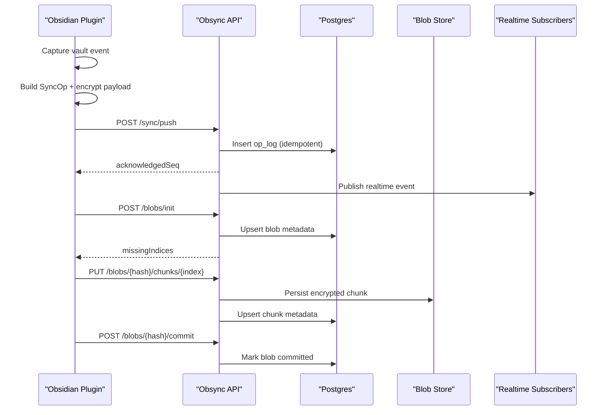

# Architecture Overview

Obsync is a single-tenant, self-hosted sync system for Obsidian vaults.

## Goals

1. Deterministic convergence for concurrent markdown edits.
2. End-to-end encrypted content at rest on server infrastructure.
3. Cursor-based offline recovery with idempotent operation ingestion.
4. Machine-readable API surface for OpenClaw and similar LLM agents.

## High-level Components

1. Obsidian plugin modules:
   - event-capture
   - op-builder
   - crdt-engine (Yjs)
   - blob-engine
   - transport
   - state-store
   - conflict-ui
   - telemetry
2. API server:
   - Auth + API key scopes
   - Sync op ingestion and pull queries
   - Blob chunk orchestration
   - Key envelope rotation
   - Realtime stream endpoint
3. Data services:
   - Postgres for metadata, op log, cursor state
   - MinIO/S3-compatible storage for encrypted blob chunks
   - Convex backend for self-hosted realtime/query layer in deployment topology
4. Observability:
   - Prometheus, Loki, Grafana, OTel collector

## Trust Boundaries

1. Client device is trusted with plaintext vault content and vault key.
2. Server is trusted for availability and integrity, not plaintext confidentiality.
3. Object store receives encrypted chunk payloads only.

## Sequence Flow

## Conflict Model

1. Markdown: CRDT merge via Yjs updates.
2. Non-markdown: last-write-wins with retained prior versions.
3. Path collisions: deterministic rename + conflict record creation.

## Compatibility Policy

1. API is versioned under `/v1`.
2. Additive schema changes only in v1 minor releases.
3. Breaking changes require `/v2`.
